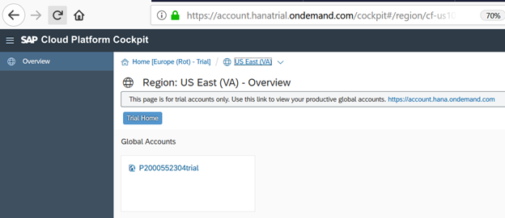
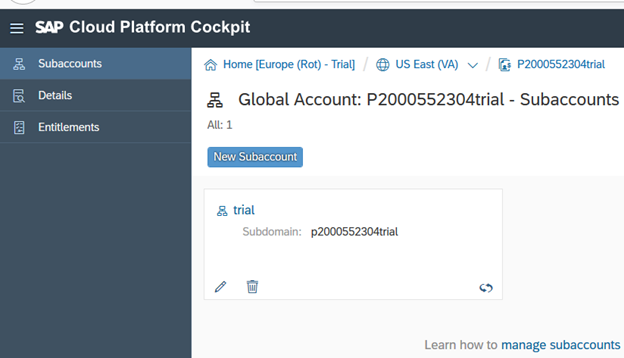
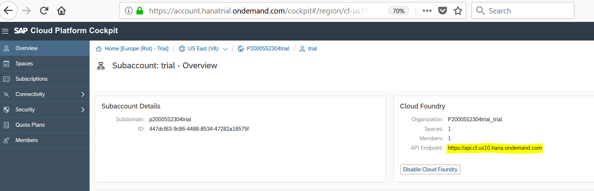
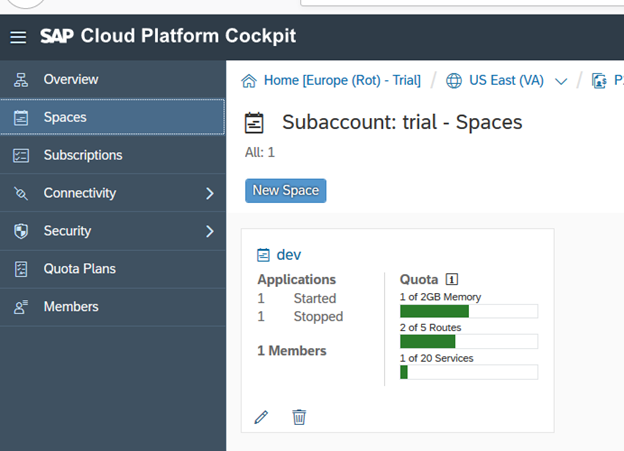
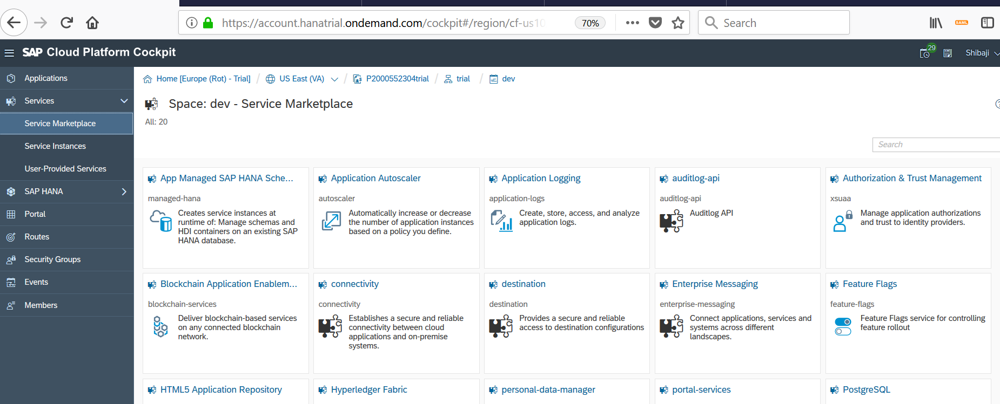

- - - -
Next Exercise: [Exercise 2 - Setup](../Exercise-02-Setup)

[Back to the Overview](../README.md)
- - - -

# Exercise 01 - Gain Basic Understanding of the Account Structure on SAP Cloud Platform

## Introduction 
In rest of the exercises, you will encounter various terms such as Global Account, Subaccount, Quota, Organization, Spaces, API endpoint, Applications and Services. The purpose of the current exercise is to help you get familiar with the terminology and the overall Account structure in SAP Cloud Platform. As such, the current exercise is not essential for completing the rest of the exercises. 

1.	When you login to [SAP Cloud Platform cockpit](https://account.hanatrial.ondemand.com/) with your credentials, you will see the home page which has a listing of Global Accounts. For the purpose of the current exercise, we will use trial account.

Global Accounts: When a Customer or Partner purchases a license for SAP Cloud Platform, they are provided with a Global Account, which represents the scope of the functionality and the level of support based on their entitlement to the platform resources and services. 
A Global Account can contain one or more Subaccounts. 

2.	On the left side you will see the regions on which SAP Cloud Platform is available, description of Services that can be used and different notifications.  

3.	Go to the subaccount trial. 

4.The exercises of the current hands-on are designed to use the Subaccount in the Cloud Foundry environment -- trial (represented by the tile on the right side). 

5.	On right you can see the API endpoint and subaccount details. This is the API endpont that will be used for SAP Web IDE Full-Stack  configuration in the [next exercise](../Exercise-02-Setup). 

API Endpoint: The API endpoint, or target URL, for your Cloud Foundry instance is the URL of the Cloud Controller. More information on our [help guide](https://help.sap.com/viewer/65de2977205c403bbc107264b8eccf4b/Cloud/en-US/350356d1dc314d3199dca15bd2ab9b0e.html)

6.	On the left, you will see variou menu options: _Oveview, Spaces, Connectivity, Security, Quota Plans, Usage Analytics and Members_. You may spend a few minutes to browse and get familiar with these areas. 

For the current hands-on exercise, you may have to repeatedly visit the _Spaces_ link

7.	Click on Spaces. 

You should see a single dev for you, we are going to use this default space for our development. However you can create your own space from the cockpit or via CLI (Command Line Interface)

8.	This is the overview page of the _Space_. 

15.	On the left, you can see links for Applications, Services and other entities. By default, Applications option (the first in the list) should be selected and on the right side, you should see a list of deployed applicatoins. Since you may not have deployed any applications yet, this page may appear empty.

16.	Click on the _Services_ link on the left panel to expand it.

Under the _Services_ tab, you will see links for _Service Marketplace, Service Instances and User-Provided Services_. 

17.	Click on _Service Marketplace_. This shows you all the services available for you to create instance of and consume them from the applications deployed in your _Space_. 

18.	Click on _Service Instances_. On this page, you will be able to see the instances of the services that you have created, and the applications  using those services. 

Since you may not have yet created any Service instances, this page should also look empty at this point of time.

User provided Service: User-provided service instances enable you to use services that are not available in the marketplace with your applications running in the Cloud Foundry environment. More information can be found in the [help guide](https://help.sap.com/viewer/65de2977205c403bbc107264b8eccf4b/Cloud/en-US/a44355e200b44b968d98ddaa42f07c3a.html?q=User-Provided%20Services) 

19. By now, you should be familiar with the basic terminologies and the key areas of the SAP Cloud Platform cockpit you will visit in the current hands-on session. 

In adition, the following steps should help you to understand how to quickly navigate to the different areas of the cockpit. 

20. If you are already on a page with overview of your _Space_, you should see a hierarchy of clickable links on the top (bread crumbs for how you started with the Home page and entered your _Space_).

Click the link pointed out to go to your space.  

Note that the trailing number in the _Space_ name will be different for each participant.

21. Click the link pointed out to go to your Subaccount (or the Organization in Cloud Foundry terminology).  

22. Click the link pointed out to go to your Global account.  

23. Click on the link pointed out to go to the Home page. 

- - - -
© 2018 SAP SE
- - - -
Next Exercise: [Exercise 2 - Setup](../Exercise-02-Setup)

[Back to the Overview](../README.md)
