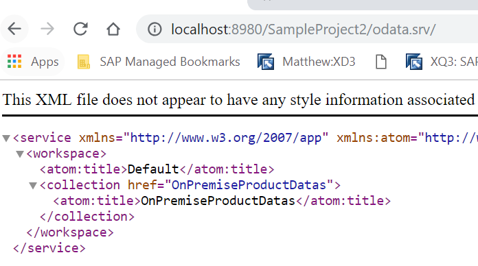
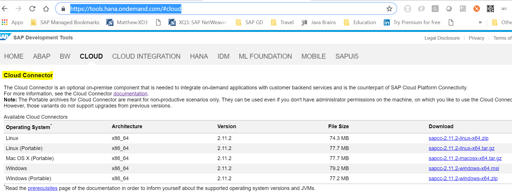
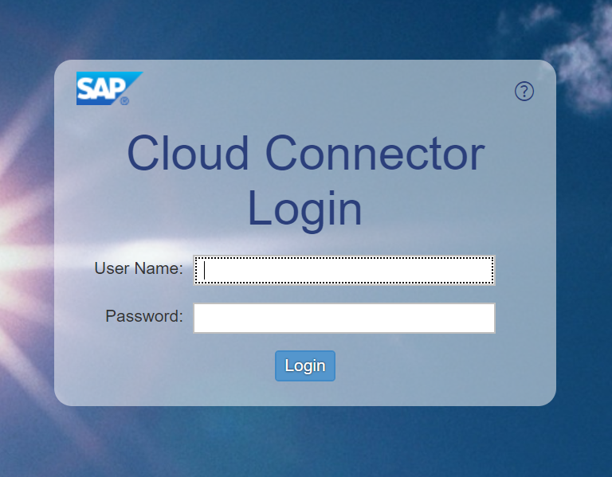
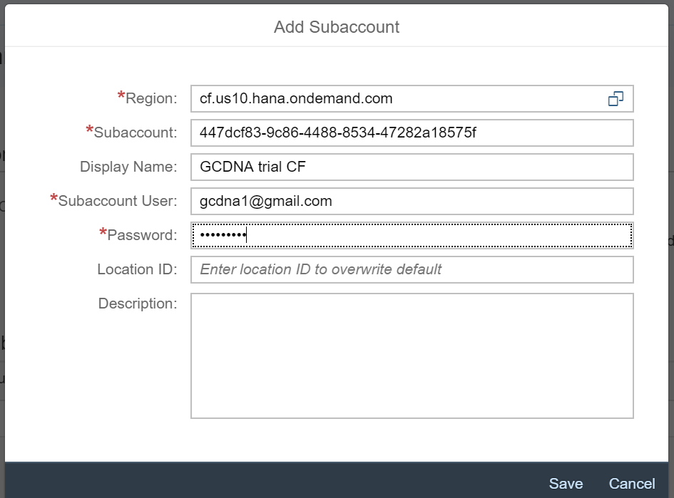
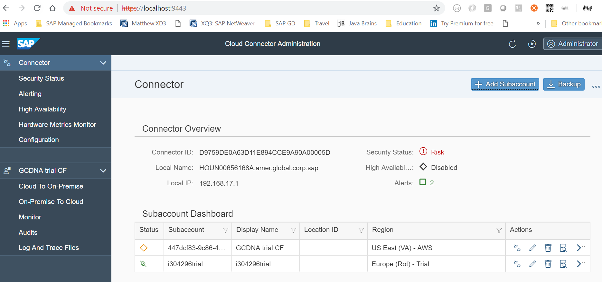
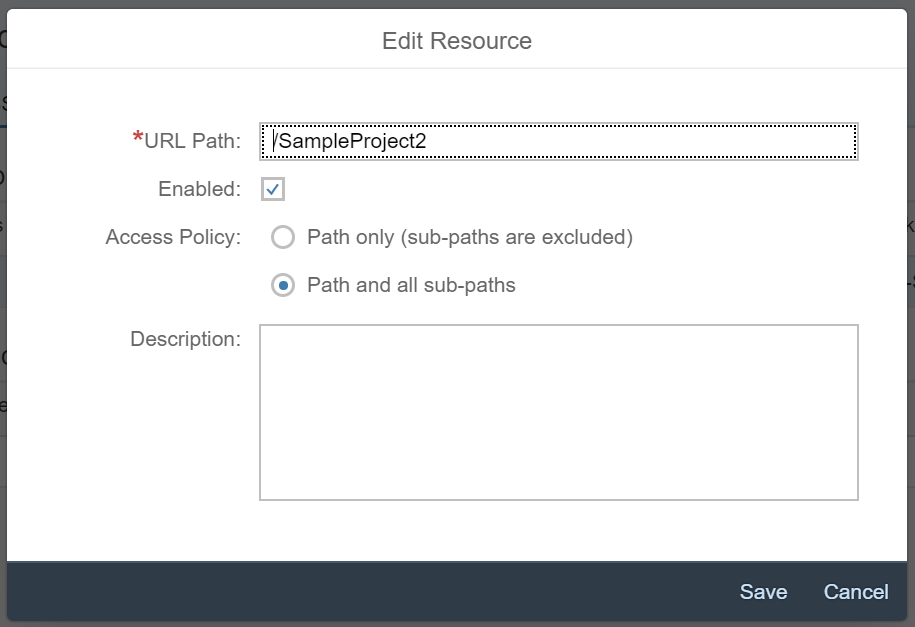
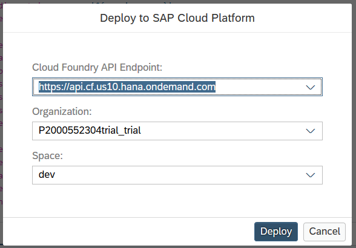

- - - -
Previous Exercise: [Exercise 3 - Publish Wishlist](../Exercise-03-Publish-Wishlist) Next Exercise: [Exercise 5 - Logging](../Exercise-05-Logging)

[Back to the Overview](../README.md)
- - - -

# Exercise 04 - Order New Items

In our scenario, Franck will need to determine which products to add to his inventory based on the feedback received on the wishlist. To do this, he will need to review the wishlist voting and comments received from his colleagues and the company’s customers through a customer portal. Franck will also need to view the existing product inventory from the on-premise backend system. Once he has decided which products to order, he will need to be able to place an order on the backend system and update the backend system inventory accordingly.

To simulate our on premise backend system, we will deploy a simple Java application which exposes product related backend APIs via OData services based on Apache Olingo Java libraries.

We will use Web IDE Full-Stack to modify our existing wishlist application to include the retrieval of data from the backed system as well as from the data stored in the SAP HANA database from the wishlist application.

**This exercise involves the following main steps.**

1.	Deploy product backend OData service.
1.	Configure the SAP Cloud Connector: Add Cloud Platform Subaccount add local backend). Configure subaccount and access OData URL.
1.	Enhance the Service for the Wishlist Application
1.	Extend the User Interface to Display On-Premise Product Data
1. 	Build and Deploy application to SAP Cloud Platform
1.	Create Destination configuration on SAP Cloud Platform
1. 	Test the application


## 1. Deploy Product Backend OData Service

We first need to deploy a pre-built Java application which will simulate our backend system. The OData service will exposes product information that can be consumed by our wishlist application.

1. Tomcat bundle is available in the TechEd student image under D:\Files\Session\OPP363\apache-tomcat-9.0.11
1. Navigate to the `bin` folder  
1. Double Click on  startup.bat file. (this will launch a command prompt and start the tomcat server).
1. Launch the URL [http://localhost:8980/SampleProject2/odata.srv](http://localhost:8980/SampleProject2/odata.srv).
<b>Note: the url of the on premise odata service can vary based on the Neo exercise</b>

    

1. Notice that the OData service exposes a collection called OnPremiseProductData. Append `/OnPremiseProductDatas` to the URL so you have [http://localhost:8980/SampleProject2/odata.srv/OnPremiseProductDatas](http://localhost:8980/SampleProject2/odata.srv/OnPremiseProductDatas).

    


## 2. Configure the SAP Cloud Connector

The Cloud Connector is an optional on-premise component that is needed to integrate on-demand applications running in the SAP Cloud Platform with customer services running in an on-premise system, and is the counterpart of SAP Cloud Platform Connectivity.

Install Cloud Connector from https://tools.hana.ondemand.com/#cloud (This should be part of prerequisite setup)


    

1. Launch SAP Cloud Connector URL [https://localhost:8443](https://localhost:8443) and login with your Administrator credentials:

   - User: `Administrator`
   - Password: your password
    

1. Add Subaccount from the SCC cockpit.

1. For _Define Subaccount_ enter the following configuration:

    | Property | Value
    |---|---|
    | Region Host | `cf.us10.hana.ondemand.com`
    | Subaccount | `<Subaccount ID Copy from Subaccount cockpit>` 
    | Display Name | `Bootcamp Trial CF`
    | Login Email ID | `<your_login_email>`
    | Password | `<Your_Password>`
    | Location ID | `Student-XX`  where XX is your two digit student number
    | Description | `Cloud Connector`

    Note that the value of Location ID is case sensitive! 
    
    Ignore the fields under the section HTTPS Proxy on the right side, leave them blank 

    

    If in the current hands-on, all participants are sharing a single SAP Cloud Platform subaccount, then to disambiguate the SAP Cloud Connector, each participant needs to provide a unique Location ID.

1. Click _Save_.
1. Ensure that the Status under Tunnel Information is Connected. If you receive an error, recheck your Region, Subaccount and login information.

    

1. Now that we have configured the SAP Cloud Connector and connected it from our local laptop to our SAP Cloud Platform account, the next thing we need to do is to configure access to the backend system.
1. In the SAP Cloud Connector UI, go to `Cloud To On-Premise` from the left-hand menu.
1. Click the `+` icon to add a new mapping virtual to internal system.

    

1. Choose Back-end Type as `Non-SAP System` and click _Next_.
1. Choose Protocol as `HTTP` and click on _Next_.
1. For Internal Host, enter:

    - Internal Host: `localhost`
    - Internal Port: `8080`

1.	Click _Next_.
1.	For Virtual Host, enter:

    - Virtual Host: `productbackend.com`
    - Virtual Port: `8080`

1.	Click Next.
1.	Leave Principal Type as `None` and click _Next_.
1. Enter a Description and click _Next_.
1. In the Summary Screen check the `Check Internal Host` check box and click _Finish_.

    

1. You should notice that the Check Results column says `Reachable` in Green.

    

1. `Under Resources Accessible On productbackend.com:8080` section, click the `+` icon to add the resources under this system.
1. Enter `/SampleProject2/` under URL Path.
1. Select the option `Path and all Sub paths`.

    

1. Click _Save_.
1. You should notice that the Status is now Green.
1. If it is not green, recheck the value for URL Path.

This completes the configuration of the SAP Cloud Connector.


## 3. Enhance the Service for the Wishlist Application

We can now open the existing wishlist application in Web IDE and modify the service module to include the backend product data from our on premise system.

1. Open Web IDE Full-Stack and open your existing `furnitureshop` application.
1. Edit `data-model.cds` under the `db` module. Add a new entity called `BackendProductData` to the end of the file using the following definition:

    ```
    entity BackEndProductData {
      key ProductID    : String;
          SUPPLIERID   : String;
          SUPPLIERNAME : String;
          PRICE        : String;
          STOCK        : String;
          DELIVERYDATE : String;
          DISCOUNT     : String;
    }
    ```

    Save the `data-model.cds` file

1. Edit `my-service.cds` under the `srv` module to add the new entity `BackendProductData`as shown below (or simply replace the entire content of the file with the following):

    ```
    using com.company.furnitureshop from '../db/data-model';

    service CatalogService {  
      entity Wishlist @read @update as projection on furnitureshop.Wishlist; 

      @cds.persistence.skip
      entity BackEndProductData as projection on furnitureshop.BackEndProductData;
    }
    ```

    Note that the `@cds.persistence.skip` specifies ***not*** to create the table entity in HANA.

    Save the `my-service.cds` file

1.	The entity `BackendProductData` is not persistent in the HANA database and the OData get operation will return an empty set. We will override the `Query` and `Read` operations of the `BackendProductData` entity by our custom implementation in Java to read the onpremise OData that we created in the previous step via the destination pointing to the virtual url defined in the Cloud Connector configuration.

1.	Under the `srv` module, navigate to src -> main -> java -> com -> company -> furnitureshop  
    Right-click and choose _Create new Java Class_ enter the class name as `BackEndProductEntity` (do not add a `.java` extension as WebIDE will do this automatically).
Replace the file with the code below:

    ```java
    package com.company.furnitureshop;

    import com.sap.cloud.sdk.result.ElementName;
    import com.sap.cloud.sdk.service.prov.api.annotations.Key;

    public class BackEndProductEntity {
      @ElementName("ProductID")
      @Key
      private String ProductID;

      @ElementName("SUPPLIERID")
      private String SUPPLIERID;

      @ElementName("SUPPLIERNAME")
      private String SUPPLIERNAME;

      @ElementName("PRICE")
      private Float PRICE;

      @ElementName("STOCK")
      private String STOCK;

      @ElementName("DELIVERYDATE")
      private String DELIVERYDATE;

      @ElementName("DISCOUNT")
      private String DISCOUNT;

      public String getPRODUCTID() {
        return ProductID;
      }

      public void setPRODUCTID(String PRODUCTID) {
        this.ProductID = PRODUCTID;
      }

      public String getSUPPLIERID() {
        return SUPPLIERID;
      }

      public void setSUPPLIERID(String SUPPLIERID) {
        this.SUPPLIERID = SUPPLIERID;
      }

      public String getSUPPLIERNAME() {
        return SUPPLIERNAME;
      }

      public void setSUPPLIERNAME(String SUPPLIERNAME) {
        this.SUPPLIERNAME = SUPPLIERNAME;
      }

      public String getSTOCK() {
        return STOCK;
      }

      public void setSTOCK(String STOCK) {
        this.STOCK = STOCK;
      }

      public String getDELIVERYDATE() {
        return DELIVERYDATE;
      }

      public void setDELIVERYDATE(String DELIVERYDATE) {
        this.DELIVERYDATE = DELIVERYDATE;
      }

      public String getDISCOUNT() {
        return DISCOUNT;
      }

      public void setDISCOUNT(String DISCOUNT) {
        this.DISCOUNT = DISCOUNT;
      }
    }
    ```

    Review the code that you just created, the class `BackEndProductEntity` defines the entity of the `BackEndProductData` Collection.

1. In the same folder create another Java class and name it as `BackendService`, paste the code below into the new file:

    ```java
    package com.company.furnitureshop;
    
    import java.util.List;
    import java.util.Map;
    import org.slf4j.Logger;
    import org.slf4j.LoggerFactory;
    import com.sap.cloud.sdk.service.prov.api.request.QueryRequest;
    import com.sap.cloud.sdk.service.prov.api.request.ReadRequest;
    import com.sap.cloud.sdk.service.prov.api.response.ErrorResponse;
    import com.sap.cloud.sdk.service.prov.api.response.QueryResponse;
    import com.sap.cloud.sdk.service.prov.api.response.ReadResponse;
    import com.sap.cloud.sdk.service.prov.api.operations.Query;
    import com.sap.cloud.sdk.service.prov.api.operations.Read;
    import com.sap.cloud.sdk.odatav2.connectivity.ODataQueryBuilder;
    import com.sap.cloud.sdk.odatav2.connectivity.ODataQueryResult;
    
    public class BackendService {
      private static final String BACKEND_DESTINATION_NAME = "ONPREM_BACKEND";
      private static final Logger logger = LoggerFactory.getLogger(BackendService.class);
    
      @Query(serviceName = "CatalogService", entity = "BackEndProductData")
      public QueryResponse getProducts(QueryRequest queryRequest) {
        logger.info("Class:BackendService - now in @Query getProducts()");
    
        QueryResponse queryResponse = null;
        try {
          logger.info("Class:BackendService - now execute query on Products");
          ODataQueryBuilder qb = ODataQueryBuilder.
            withEntity("/backend-odata/Product.svc", "OnPremiseProductData").
            select("ProductID", "SUPPLIERID", "SUPPLIERNAME", "PRICE", "STOCK", "DELIVERYDATE","DISCOUNT");
    
          logger.info("Class:BackendService - After ODataQueryBuilder: ");
          ODataQueryResult result = qb.enableMetadataCache().
            build().
            execute(BACKEND_DESTINATION_NAME);
    
          logger.info("Class:BackendService - After calling backend OData V2 service: result: ");
    
          List<Map<String, Object>> v2BackEndProductsMap = result.asListOfMaps();
          queryResponse = QueryResponse.setSuccess().setData(v2BackEndProductsMap).response();

          return queryResponse;
        }
        catch (Exception e) {
          logger.error("Class:BackendService ==> Exception calling backend OData V2 service for Query of Products: " + e.getMessage());
    
          ErrorResponse errorResponse = ErrorResponse.getBuilder().
            setMessage("Class:BackendService ==> There is an error.  Check the logs for the details.").setStatusCode(500).
            setCause(e).
            response();
          queryResponse = QueryResponse.setError(errorResponse);
        }

        return queryResponse;
      }
    
      @Read(entity = "BackEndProductData", serviceName = "CatalogService")
      public ReadResponse getProduct(ReadRequest readRequest) {
        logger.info("Class:BackendService - at Read "+readRequest.getKeys().get("ProductID").toString());
        ReadResponse readResponse = null;
    
        try {
          logger.info("Class:BackendService - getProduct inside with ProductID = " + readRequest.getKeys().get("ProductID").toString());
          ODataQueryResult readResult = ODataQueryBuilder.
            withEntity("/backend-odata/Product.svc",
              "OnPremiseProductData('" +
              readRequest.getKeys().get("ProductID").toString() +
              "')").
            select("ProductID", "SUPPLIERID", "SUPPLIERNAME", "PRICE", "STOCK", "DELIVERYDATE", "DISCOUNT").
            enableMetadataCache().
            build().
            execute(BACKEND_DESTINATION_NAME);
    
          BackEndProductEntity readProdEntity = readResult.as(BackEndProductEntity.class);
          readResponse = ReadResponse.setSuccess().setData(readProdEntity).response();
    
          logger.info("Class:BackendService - After calling backend OData V2 READ service: readResponse : " + readResponse);
        }
        catch (Exception e) {
          logger.error("==> Exception calling backend OData V2 service for READ of Products: " + e.getMessage());
    
          ErrorResponse errorResponse = ErrorResponse.getBuilder().
            setMessage("There is an error.  Check the logs for the details.").
            setStatusCode(500).
            setCause(e).
            response();
          readResponse = ReadResponse.setError(errorResponse);
        }

        return readResponse;
      }
    }
    ```
    
    Review the Java code that you created, the `@Query` annotation implements the query operation for the `BackEndProductData` entity set and the `@Read` annotation for reading a single `BackEndProductData` entity. We use SAP Cloud Platform SDK to query the backend via destinations.

1. In the same folder create another Java class and name it as WishlistHandler (do not add a `.java` extension as WebIDE will do this automatically). Replace the contents of file with the code shown below:

    This Java Class handles the Wishlist collection's update method which will be used in the next exercise

    ```java
    package com.company.furnitureshop;
    
    import org.slf4j.Logger;
    import org.slf4j.LoggerFactory;
    import com.sap.cloud.sdk.service.prov.api.operations.Update;
    import com.sap.cloud.sdk.service.prov.api.response.UpdateResponse;
    import com.sap.cloud.sdk.service.prov.api.request.UpdateRequest;
    import com.sap.cloud.sdk.service.prov.api.EntityData;
    import com.sap.cloud.sdk.service.prov.api.ExtensionHelper;
    import com.sap.cloud.sdk.service.prov.api.DataSourceHandler;
    import java.util.Map;
    import java.util.HashMap;
    import java.util.List;
    import java.util.ArrayList;
    import com.sap.cloud.sdk.service.prov.api.response.ErrorResponse;
    
    public class WishlistHandler {
      private static final Logger logger = LoggerFactory.getLogger(WishlistHandler.class.getName());
      @Update(entity = "Wishlist", serviceName = "CatalogService")
      public UpdateResponse updateWishlist(UpdateRequest updateRequest, ExtensionHelper extensionHelper) {

        EntityData entityData = updateRequest.getData();

        Map<String, Object> keyMap = new HashMap<String, Object>();
        keyMap.put("ProductID", entityData.getElementValue("ProductID"));
        DataSourceHandler handler = extensionHelper.getHandler();

        try {
          EntityData existingWishlistData = handler.
            executeRead("Wishlist", keyMap, getWishlistPropertyNames());

          EntityData updatedWishlistData = EntityData.
            getBuilder(existingWishlistData).
            removeElement("productRating").
            addElement("productRating",entityData.getElementValue("productRating")).
            buildEntityData("Wishlist");

          handler.executeUpdate(updatedWishlistData, updateRequest.getKeys(), false);
        }
        catch (Exception e) {
          ErrorResponse err = ErrorResponse.
            getBuilder().
            setMessage("Failed to Update Wishlist. Check log for more details.").
            setStatusCode(500).
            response();

          return UpdateResponse.setError(err);
        }

        return UpdateResponse.setSuccess().response();
      }
      
      public static List<String> getWishlistPropertyNames() {
        List<String> propertyNames = new ArrayList<String>();
        
        propertyNames.add("ProductID");
        propertyNames.add("categoryName");
        propertyNames.add("productName");
        propertyNames.add("productDesc");
        propertyNames.add("productColor");
        propertyNames.add("productWidth");
        propertyNames.add("productHeight");
        propertyNames.add("productDepth");
        propertyNames.add("productWeight");
        propertyNames.add("productPrice");
        propertyNames.add("productWarranty");
        propertyNames.add("materialType");
        propertyNames.add("supplierID");
        propertyNames.add("supplierName");
        propertyNames.add("supplierLocation");
        propertyNames.add("pictureURL");
        propertyNames.add("productRating");
        
        return propertyNames;
      }
    }
    ```

1. Save the file

## 4. Extend the User Interface to Display On-Premise Product Data

We will next extend the user interface to include capabilities to display the on-premise product data as well as the UI to show the ratings of the products in in the wishlist. The ratings will be captured in the next exercise.

There are 2 things we need to change in the UI:  

* Add a new Tab to show Backend Product Data that we fetch from on-Premise system.<br>
* Update the code to Display Product Ratings.<br>

1. Expand the folder ui -> module -> webapp -> view and open the file `Detail.view.xml`.  Replace the contents of the file with this [DetailView](https://github.com/SAP/cloud-cf-furnitureshop-demo/blob/step2-order-service/ui/webapp/view/Detail.view.xml)

1. Save the file

1. Now expand the folder ui -> application -> webapp -> controller and open `Detail.controller.js`. Replace the contents of the file with this [Detail.controller](https://github.com/SAP/cloud-cf-furnitureshop-demo/blob/step2-order-service/ui/webapp/controller/Detail.controller.js)

1. Open the `mta.yaml` file in the top-level project folder

    

    Replace the contents of `mta.yaml` with this version [mta.yaml](https://github.com/SAP/cloud-cf-furnitureshop-demo/blob/step2-order-service/mta.yaml)


## 5. Build and Deploy Application to SAP Cloud Platform

We are now ready to build the project furnitureshop and deploy it to Cloud Foundry.

1. Right-click your project and select _Build_. then choose _Build CDS_.
1. Confirm that the Build CDS has completed successfully.
1. Right-click your project and click _Build_ and then select _Build_.  This option takes the compiled CDS data model and creates a `.mtar` file

    

1. Confirm that a `.mtar` file has been created under the newly created `mta_archives` folder.
1. Expand the `mta_archives` folder and right-click the `furnitureshop0.0.1.mtar` file.  Select _Deploy_ -> _Deploy to SAP Cloud Platform_.

    

1. You may get a popup asking you to enter your credentials, please enter your id/password, then in the _Deploy to SAP Cloud Platform_ dialog, enter:

    - Cloud Foundry API Endpoint: `https://api.cf.us10.hana.ondemand.com`
    - Organization: `<your id>trial_trial`
    - Space: `dev`

    

    Wait until the deployment is complete and ensure it was successful, meanwhile you can login to the cockpit to view the applications being deployed. Please do not click on your funitureshop application until the deployment has completed.


## 6. Create Destination Configuration on SAP Cloud Platform

Please make sure the deployment is complete. The next thing we will need to do is create an instance of destination service on SAP Cloud Platform as well as a destination configuration. This will allow us to access the on premise backend system in our applications on SAP Cloud Platform by using the virtual URL we configured in the cloud connector.

1. In your SAP Cloud Platform admin cockpit, go to your Cloud Foundry Subaccount and navigate to your space.
1. Expand Services, then select Service Instances

    

1. Click on the `destination` service instance, then from the menu on the left, select Destinations
1. Click on New Destination and enter the following:

    | Property | Value |
    |---|---|
    | Name | `getWishlist`
    | Type | `HTTP`
    | Description | `Get Wishlist`
    | URL | `<Paste the srv application url that you copied>`<br>(Make sure you add `https://` to the beginning of the URL)
    | Proxy Type | `Internet`
    | Authentication | `NoAuthentication`

   Your destination should now look like this:

    

1. Click on Save and add a second destination with the following values:
      
    | Property | Value |
    |---|---|
    | Name | `ONPREM_BACKEND`
    | Type | `HTTP`
    | Description | `Local Backend`
    | Location ID | `OPP363-XX`  where XX is your two-digit student number<br>***Important***<br>This field value is case-sensitive and will only become visible ***after*** you have selected a Proxy Type of `OnPremise`
    | URL | `http://productbackend.com:8080`
    | Proxy Type | `OnPremise`
    | Authentication | `NoAuthentication`

1. Your destination should now look like this:

    

    Click on Save

## 7. Test the application

1. In the SAP Cloud Platform Cockpit -> Navigate to your Space -> Applications

1. If you have followed all the steps from the start of Exercise 3, You should see 4 applications

    - `db`  
        This is the implementation of your data model.  It was deployed as part of the MTA deployment and will be stopped by default.  Please do not delete or modify this app.
    - `srv`  
        This is the service created to expose your data model.  This module has been implemented in Java and was deployed as part of the MTA deployment
    - `webide-builder-sapwebide-di-<SOME_RANDOM_STRING>`  
        This is the CDS builder tool that you installed in Exercise 1. Every time you select "Build CDS" or "Build" from a context menu, you are invoking this tool.  Please ***do not*** delete this application!
    - `ui`  
        This is the HTML5 wishlist application containing the UI logic that was deployed as part of the MTA deployment

1. Click on the srv application, then click on the link under Application Routes to launch the srv application

    

1. You should now be able to see the URL to the ODATA service that the srv application has created.  On clicking the link you should now see a new collection `BackEndProductData`

    

1. Append /BackEndProductData to the url to view the Collection

    

1. To test the ui application, navigate to the wishlist application in the SAP Cloud Platform cockpit and launch the URL.  You will see a new tab showing the Backend Product information.  However, you will probably not see any ratings yet as this functionality will be added in the next exercise

    

- - - -
© 2018 SAP SE
- - - -
Previous Exercise: [Exercise 3 - Publish Wishlist](../Exercise-03-Publish-Wishlist) Next Exercise: [Exercise 5 - Logging](../Exercise-05-Logging)

[Back to the Overview](../README.md)
